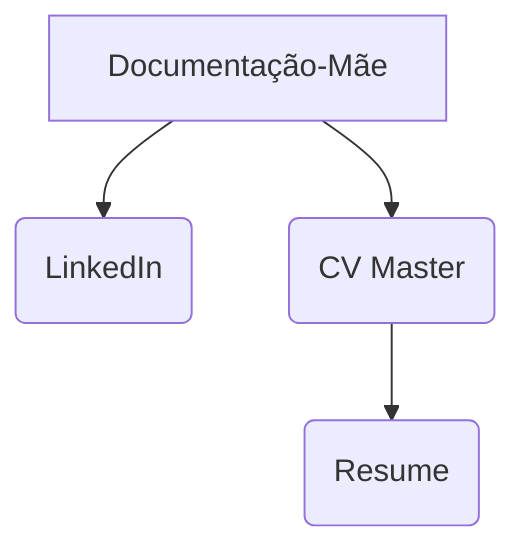

Para o LinkedIn: Pegas nos factos brutos da documentação-mãe e escreves em frases completas para que qualquer pessoa consiga ler e perceber a complexidade técnica do teu trabalh

Para o CV: Pegas na documentação-mãe e aplicas o modelo STAR (Situation, Task, Action, Result) em formato de bullets muito curtos e densos.

Para o Resume: Pegas no teu CV longo e cortas impiedosamente tudo o que não seja resposta direta aos requisitos da vaga que tens à frente.
